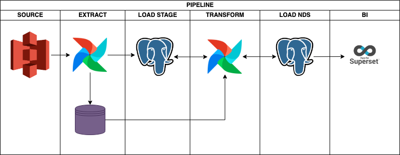
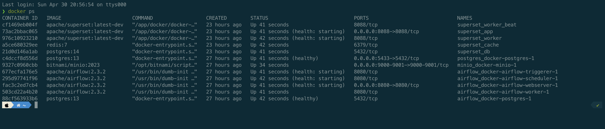
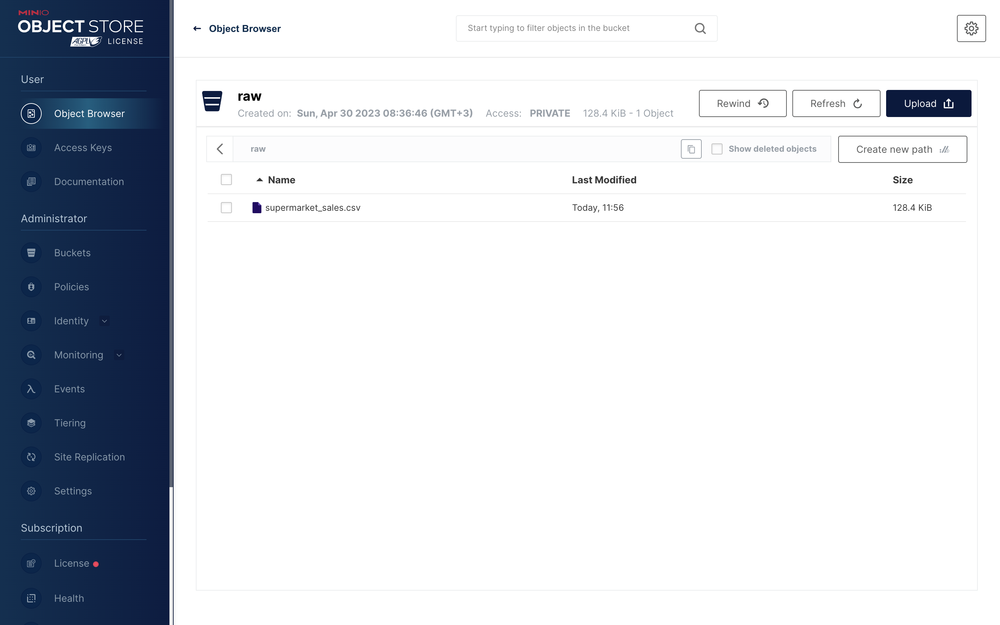
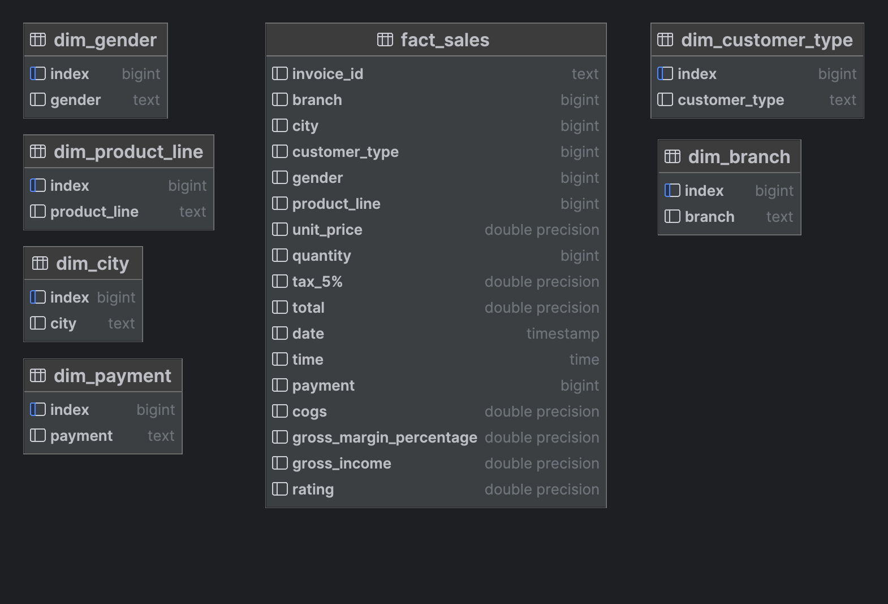
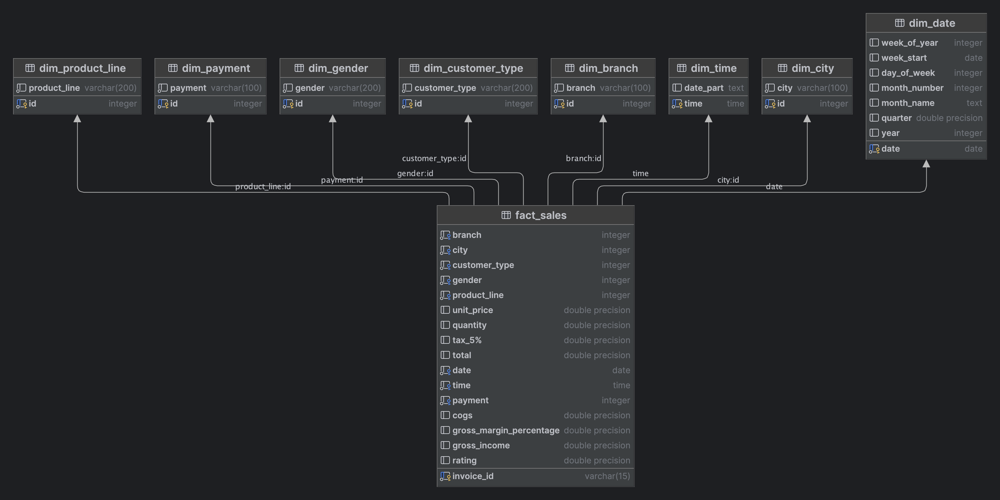
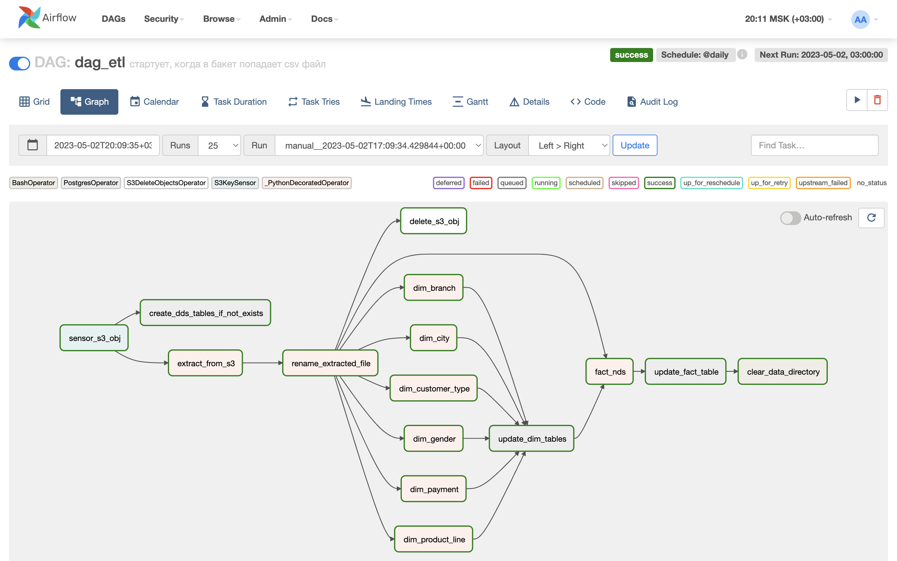
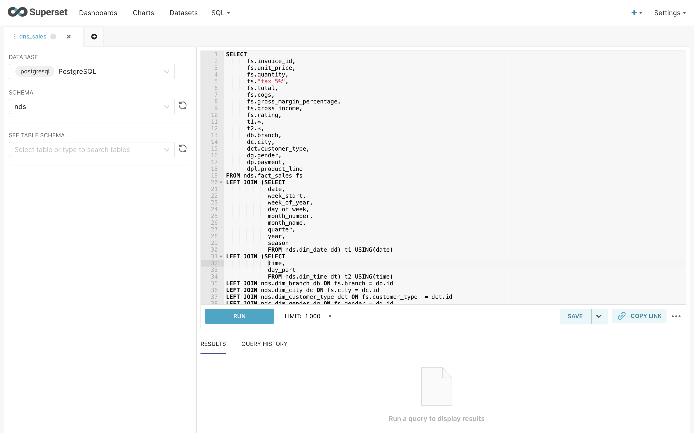
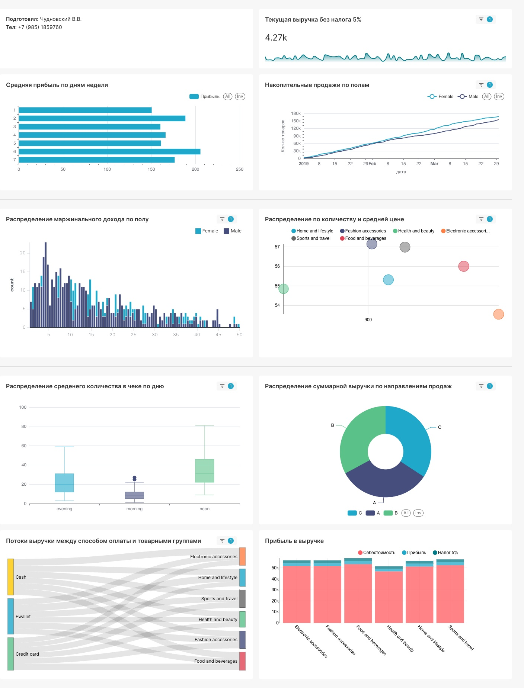
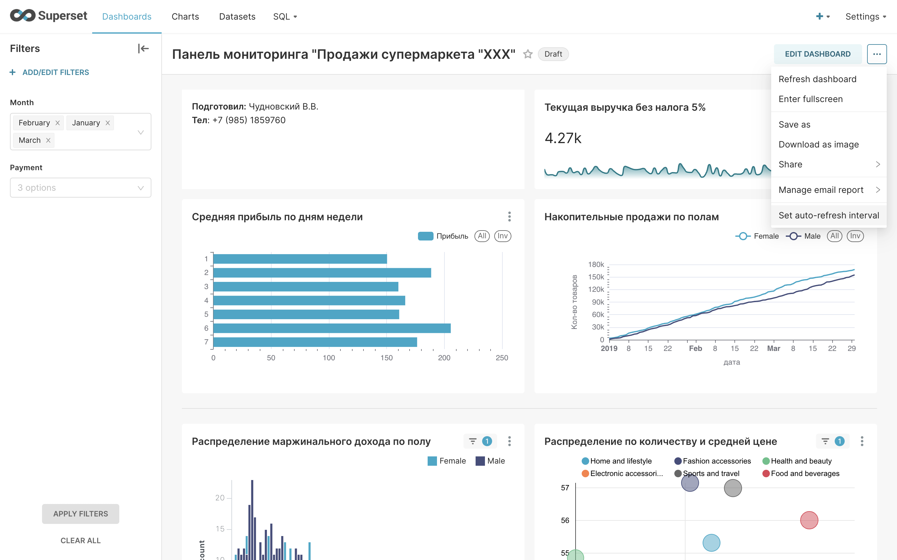

## Описание проекта
Целью настоящего проекта является демонстрация возможностей опенсорсного ПО в обработке данных.
Бизнес логика следующая:
* Заказчик кладет в s3-совместимый бакет csv файл с выгруженными данными о продажах супермаркета  
* Название файла меняться НЕ должно. Наличие суффикса в виде даты и тп обсуждается дополнительно
* Состав и название колонок меняться НЕ должны. Предполагается что выгрузка осуществляется из единой системы заказчика.
* Периодичность выгрузки и пересечение данных значения НЕ имеет

## Описание инфраструктуры
Предполагается что инфраструктура будет располагаться в облаке, но ввиду отсутствия доступа к облакам и в целях демонстрации 
развернем инфраструктуру в докер-контейнерах на локальном компьютере c mac osx m1  
____
Схема инфраструктуры   

#### Airflow
1. Скачиваем в директорию с проектом файл __docker-compose.yaml__ `curl -LfO 'https://airflow.apache.org/docs/apache-airflow/2.3.3/docker-compose.yaml'`
2. Создаем директории `mkdir -p ./dags ./logs ./plugins ./data`. Data понадобится когда будем скачивать сырые файлы
3. Для работы на локальном компе можно выставить `AIRFLOW__CORE__EXECUTOR: LocalExecutor` и удалить из __docker-compose.yaml__ все что связано с celery и redis, но профиту от этого мало
4. Инициализируем базу __AIRFLOW__ командой `docker compose up airflow-init`. Сборка завершена с кодом 0 - т.е. успешно
5. Запускаем остальные контейнеры с севисами __AIRFLOW__ `docker-compose up -d`
6. Если надо добавить библиотеки создаем __requirements.txt__, пересобираем образ командой `docker build . --tag extending_airflow:latest`. При этом прописываем название после тега в копии __docker-compose.yaml__
7. Переназываем новый __docker-compose-ext.yaml__
8. Закрываем все контейнеры командой `docker compose down`
9. Заново инициализируем базу __AIRFLOW__ командой `docker compose up airflow-init` на основе первого __docker-compose.yaml__ 
10. Запускаем остальные контейнеры на основе расширенного __docker-compose-ext.yaml__ `docker-compose -f docker-compose-ext.yaml up -d --no-deps --build airflow-webserver airflow-scheduler airflow-worker airflow-triggerer`

#### DWH
11. Поднимаем контейнер с __DWH на posrgres__. Переходим в папку `postgres_docker` и находясь там запускаем `docker-compose up -d`

#### Minio (S3)
12. Поднимаем контейнер с __minio бакет сомвестисый с s3__. Переходим в папку `minio_docker` и находясь там запускаем `docker-compose up -d`

#### BI
13. Поднимаем контейнер с __SUPERSET__. Переходим в папку `superset_docker` и находясь там запускаем `docker-compose -f docker-compose-non-dev.yml`
____
Проверяем работоспособность всех контейнеров 
____
Пробуем загрузить файл в бакете 

## Описание схемы хранилища
1. Хранилище будет располагаться на базе __postgres__
2. Хранилище будет состоять из двух слоев:
   * __nds__, куда будем заливать нормализованные до 3NF таблицы фактов и измерений, но уникальные, но без ключей
   * __dds__, куда будем перегружать данные из таблиц фактов и измерений с преобразованными форматами, ключами. При этом таблицы в dds будут обновляться только свежими данными, т.е. если значение измерения или номер заказа в фактах уже есть эта строка проигнорируется
3. Формирование витрин будет осуществляться в BI системе на базе __apache superset__ по запросу заказчика. В качестве демонстрации будет создана денормализованная таблица с расширенными признаками времени и даты

____
Схема слоя NDS   
____
Схема слоя DDS 

## Описание ETL процесса
1. Заказчик кладет выгрузку в формате csv в бакет совместимый с S3
2. Даг airflow активируется при срабатывании сенсора, когда в определенный бакет попадает определенный файл
3. Следующий таск сохраняет файл в файловой системе airflow (предполагается что заказчик присылает выгрузку не за 10 лет. несколько сотен тысяч строк допустимо)
4. При сохранении файла airflow дает ему техническое название и сохраняет без расширения. Перенаименовываем сохраненный файл
5. Параллельно проверяем есть ли нужные сущности в слое nds. Если нет - создаем их. По идее создание таблиц осуществится в первый раз. В последующие разы тас будет проходить мимо
6. Сразу же заливаем измерения Время и Дата, так как они не зависят от получаемых данных
7. Из полученного файла получаем уникальные названия измерений:  
   * Направление продаж
   * Гендер
   * Товарная группа
   * Способ оплаты
   * Город
   * Тип покупателя  
   Во избежание конфликтов postgres заливаем эти данные как есть в слой stage. Не заботимся ни о ключах ни о формате
8. После сохранения файла в файловой системе удаляем его из s3
9. После сохранения таблиц с измерениями в stage сравниваем названия с уже существующими уникальными значениями в аналогичных таблицах в слое nds
10. Т.к. таблицы в слое nds обладают инкрементальными ключами добавление новых значений будет увеличивать номера ключей. Прежние ключи останутся без изменений
11. В следующем таске получаем обновленные таблицы с измерениями и ключами и преобразуем их в питоновские словари меняя местами ключ-значение
12. Снова возвращаемся к скаченному файлу и меняем все измерения с текста на номера ключей. Преобразуем форматы дат и времени
13. Заливаем полученную таблицу в слой nds
14. Сравниваем номера заказов с номерами ранее загруженных строк с заказами в слое nds и добавляем новые уникальные строки с заказами
15. Таким образом мы будем получать новые данные не затирая предыдущие и исключаем возможное дублирование  
16. После сохранения свежих фактов в слое nds удаляем файл csv из файловой системы airflow
_____
Схема ETL процесса (DAG)   
_____
## 👉[ТУТ !!! Python скрипт с DAG-ом !!! ТУТ](airflow_docker/dags/dag_etl_taskflow.py) 👈
_____
<html>
<body bgcolor="#2b2b2b">
<table CELLSPACING=0 CELLPADDING=5 COLS=1 WIDTH="100%" BGCOLOR="#606060" >
<tr><td>

dag_etl_taskflow.py

</td></tr></table>
<pre><a name="l1">1    </a>import os
<a name="l2">2    </a>import sqlalchemy
<a name="l3">3    </a>from datetime import datetime, timedelta
<a name="l4">4    </a>import numpy as np
<a name="l5">5    </a>import pandas as pd
<a name="l6">6    </a>from airflow import DAG
<a name="l7">7    </a>from airflow.decorators import task
<a name="l8">8    </a>from airflow.operators.bash import BashOperator
<a name="l9">9    </a>from airflow.providers.amazon.aws.hooks.s3 import S3Hook
<a name="l10">10   </a>from airflow.providers.amazon.aws.sensors.s3 import S3KeySensor
<a name="l11">11   </a>from airflow.providers.postgres.hooks.postgres import PostgresHook
<a name="l12">12   </a>from airflow.providers.postgres.operators.postgres import PostgresOperator
<a name="l13">13   </a>from airflow.providers.amazon.aws.operators.s3_delete_objects import S3DeleteObjectsOperator
<a name="l14">14   </a>
<a name="l15">15   </a>raw_key = 'supermarket_sales.csv'
<a name="l16">16   </a>raw_bucket = 'raw'
<a name="l17">17   </a>raw_local_path = 'data'
<a name="l18">18   </a>file_new_name = 'downloaded_from_minio.csv'
<a name="l19">19   </a>nds_layer = 'nds'
<a name="l20">20   </a>dds_layer = 'dds'
<a name="l21">21   </a>default_args = {
<a name="l22">22   </a>    'owner': 'Victor',
<a name="l23">23   </a>    'retries': 5,
<a name="l24">24   </a>    'retry_delay': timedelta(minutes=10)
<a name="l25">25   </a>}
<a name="l26">26   </a>
<a name="l27">27   </a>with DAG(
<a name="l28">28   </a>        dag_id='dag_etl',
<a name="l29">29   </a>        description='стартует, когда в бакет попадает csv файл',
<a name="l30">30   </a>        start_date=datetime(2023, 4, 27, 0),
<a name="l31">31   </a>        schedule_interval='@daily',
<a name="l32">32   </a>        default_args=default_args
<a name="l33">33   </a>) as dag:
<a name="l34">34   </a>    task_s3_sensor = S3KeySensor(
<a name="l35">35   </a>        task_id='sensor_s3_obj',
<a name="l36">36   </a>        bucket_name=raw_bucket,
<a name="l37">37   </a>        bucket_key=raw_key,
<a name="l38">38   </a>        aws_conn_id='minio_conn',
<a name="l39">39   </a>        mode='poke',
<a name="l40">40   </a>        poke_interval=5,
<a name="l41">41   </a>        timeout=30 # Тут надо выставить 24*60*60 - т.е. все сутки, НО комп сильно устает
<a name="l42">42   </a>    )
<a name="l43">43   </a>    task_create_tables = PostgresOperator(
<a name="l44">44   </a>        task_id='create_nds_tables_if_not_exists',
<a name="l45">45   </a>        postgres_conn_id='postgres_conn',
<a name="l46">46   </a>        sql=f&quot;&quot;&quot;
<a name="l47">47   </a>            CREATE SCHEMA IF NOT EXISTS {dds_layer};
<a name="l48">48   </a>            CREATE SCHEMA IF NOT EXISTS {nds_layer};
<a name="l49">49   </a>    
<a name="l50">50   </a>            SET search_path TO {dds_layer};        
<a name="l51">51   </a>            
<a name="l52">52   </a>            --// создаем таблицу с ветками //--
<a name="l53">53   </a>            CREATE TABLE IF NOT EXISTS dim_branch(
<a name="l54">54   </a>            id SERIAL PRIMARY KEY,
<a name="l55">55   </a>            branch VARCHAR(100) NOT NULL);
<a name="l56">56   </a>            
<a name="l57">57   </a>            --// создаем таблицу с городами //--
<a name="l58">58   </a>            CREATE TABLE IF NOT EXISTS dim_city(
<a name="l59">59   </a>            id SERIAL PRIMARY KEY,
<a name="l60">60   </a>            city VARCHAR(100) NOT NULL);
<a name="l61">61   </a>            
<a name="l62">62   </a>            --// создаем таблицу с типами клиентов //--
<a name="l63">63   </a>            CREATE TABLE IF NOT EXISTS dim_customer_type(
<a name="l64">64   </a>            id SERIAL PRIMARY KEY,
<a name="l65">65   </a>            customer_type VARCHAR(200) NOT NULL);
<a name="l66">66   </a>            
<a name="l67">67   </a>            --// создаем таблицу с гендерами //--
<a name="l68">68   </a>            CREATE TABLE IF NOT EXISTS dim_gender(
<a name="l69">69   </a>            id SERIAL PRIMARY KEY,
<a name="l70">70   </a>            gender VARCHAR(200) NOT NULL);
<a name="l71">71   </a>            
<a name="l72">72   </a>            --// создаем таблицу с продуктовыми линейками //--
<a name="l73">73   </a>            CREATE TABLE IF NOT EXISTS dim_product_line(
<a name="l74">74   </a>            id SERIAL PRIMARY KEY,
<a name="l75">75   </a>            product_line VARCHAR(200) NOT NULL);
<a name="l76">76   </a>            
<a name="l77">77   </a>            --// создаем таблицу с видами оплат //--
<a name="l78">78   </a>            CREATE TABLE IF NOT EXISTS dim_payment(
<a name="l79">79   </a>            id SERIAL PRIMARY KEY,
<a name="l80">80   </a>            payment VARCHAR(100) NOT NULL);
<a name="l81">81   </a>            
<a name="l82">82   </a>            --// создаем таблицу с фактами //--       
<a name="l83">83   </a>            CREATE TABLE IF NOT EXISTS fact_sales(
<a name="l84">84   </a>            invoice_id VARCHAR(15) PRIMARY KEY,
<a name="l85">85   </a>            branch INT NOT NULL REFERENCES dim_branch(id),
<a name="l86">86   </a>            city INT NOT NULL REFERENCES dim_city(id),
<a name="l87">87   </a>            customer_type INT NOT NULL REFERENCES dim_customer_type(id),
<a name="l88">88   </a>            gender INT NOT NULL REFERENCES dim_gender(id),
<a name="l89">89   </a>            product_line INT NOT NULL REFERENCES dim_product_line(id),
<a name="l90">90   </a>            unit_price DOUBLE PRECISION,
<a name="l91">91   </a>            quantity DOUBLE PRECISION,
<a name="l92">92   </a>            &quot;tax_5%&quot; DOUBLE PRECISION,
<a name="l93">93   </a>            total DOUBLE PRECISION,
<a name="l94">94   </a>            date DATE NOT NULL,
<a name="l95">95   </a>            time TIME NOT NULL,
<a name="l96">96   </a>            payment INT NOT NULL REFERENCES dim_payment(id),
<a name="l97">97   </a>            cogs DOUBLE PRECISION,
<a name="l98">98   </a>            gross_margin_percentage DOUBLE PRECISION,
<a name="l99">99   </a>            gross_income DOUBLE PRECISION,
<a name="l100">100  </a>            rating DOUBLE PRECISION);        
<a name="l101">101  </a>        &quot;&quot;&quot;
<a name="l102">102  </a>    )
<a name="l103">103  </a>    task_update_dims = PostgresOperator(
<a name="l104">104  </a>        task_id='update_dim_tables',
<a name="l105">105  </a>        postgres_conn_id='postgres_conn',
<a name="l106">106  </a>        sql=f&quot;&quot;&quot;
<a name="l107">107  </a>            SET search_path TO {dds_layer};    
<a name="l108">108  </a>            
<a name="l109">109  </a>            --// Обновляем таблицы в dds сырыми таблицами из nds //--
<a name="l110">110  </a>            INSERT INTO dim_branch (branch)
<a name="l111">111  </a>            (SELECT branch FROM {nds_layer}.dim_branch WHERE branch NOT IN (SELECT branch FROM dim_branch));
<a name="l112">112  </a>            INSERT INTO dim_city (city)
<a name="l113">113  </a>            (SELECT city FROM {nds_layer}.dim_city WHERE city NOT IN (SELECT city FROM dim_city));
<a name="l114">114  </a>            INSERT INTO dim_customer_type (customer_type)
<a name="l115">115  </a>            (SELECT customer_type FROM {nds_layer}.dim_customer_type WHERE customer_type NOT IN (SELECT customer_type FROM dim_customer_type));
<a name="l116">116  </a>            INSERT INTO dim_gender (gender)
<a name="l117">117  </a>            (SELECT gender FROM {nds_layer}.dim_gender WHERE gender NOT IN (SELECT gender FROM dim_gender));
<a name="l118">118  </a>            INSERT INTO dim_product_line (product_line)
<a name="l119">119  </a>            (SELECT product_line FROM {nds_layer}.dim_product_line WHERE product_line NOT IN (SELECT product_line FROM dim_product_line));
<a name="l120">120  </a>            INSERT INTO dim_payment (payment)
<a name="l121">121  </a>            (SELECT payment FROM {nds_layer}.dim_payment WHERE payment NOT IN (SELECT payment FROM dim_payment));
<a name="l122">122  </a>             
<a name="l123">123  </a>            &quot;&quot;&quot;
<a name="l124">124  </a>    )
<a name="l125">125  </a>    task_update_fact = PostgresOperator(
<a name="l126">126  </a>        task_id='update_fact_table',
<a name="l127">127  </a>        postgres_conn_id='postgres_conn',
<a name="l128">128  </a>        sql=f&quot;&quot;&quot;
<a name="l129">129  </a>            SET search_path TO {dds_layer};
<a name="l130">130  </a>            
<a name="l131">131  </a>            --// Обновляем таблицу с фактом свежей таблицей с фактами из stage //--
<a name="l132">132  </a>            INSERT INTO fact_sales (invoice_id, branch, city, customer_type, gender,
<a name="l133">133  </a>                                    product_line, unit_price, quantity, &quot;tax_5%&quot;, total, date,
<a name="l134">134  </a>                                    time, payment, cogs, gross_margin_percentage, gross_income, rating)
<a name="l135">135  </a>            (SELECT 
<a name="l136">136  </a>                    invoice_id, branch, city, customer_type, gender, 
<a name="l137">137  </a>                    product_line, unit_price, quantity, &quot;tax_5%&quot;, total, date::date,
<a name="l138">138  </a>                    time, payment, cogs, gross_margin_percentage, gross_income, rating 
<a name="l139">139  </a>            FROM {nds_layer}.fact_sales WHERE invoice_id NOT IN (SELECT invoice_id FROM fact_sales));
<a name="l140">140  </a>            &quot;&quot;&quot;
<a name="l141">141  </a>    )
<a name="l142">142  </a>    task_delete_s3_obj = S3DeleteObjectsOperator(
<a name="l143">143  </a>        task_id='delete_s3_obj',
<a name="l144">144  </a>        bucket=raw_bucket,
<a name="l145">145  </a>        keys=raw_key,
<a name="l146">146  </a>        aws_conn_id='minio_conn',
<a name="l147">147  </a>        trigger_rule='none_failed_min_one_success'
<a name="l148">148  </a>    )
<a name="l149">149  </a>    task_clear_data_directory = BashOperator(
<a name="l150">150  </a>        task_id='clear_data_directory',
<a name="l151">151  </a>        bash_command='rm -rf ${pwd}data/* | echo &quot;приехали&quot;'
<a name="l152">152  </a>    )
<a name="l153">153  </a>
<a name="l154">154  </a>
<a name="l155">155  </a>    @task
<a name="l156">156  </a>    def extract_from_s3(bucket_key, bucket_name, local_path):
<a name="l157">157  </a>        hook = S3Hook('minio_conn')
<a name="l158">158  </a>        file_name = hook.download_file(bucket_key, bucket_name, local_path)
<a name="l159">159  </a>        return file_name
<a name="l160">160  </a>
<a name="l161">161  </a>
<a name="l162">162  </a>    @task
<a name="l163">163  </a>    def rename_extracted_file(file_name, file_new_name):
<a name="l164">164  </a>        downloaded_file_path = '/'.join(file_name.split('/')[:-1])
<a name="l165">165  </a>        os.rename(src=file_name, dst=f&quot;{downloaded_file_path}/{file_new_name}&quot;)
<a name="l166">166  </a>        return downloaded_file_path
<a name="l167">167  </a>
<a name="l168">168  </a>
<a name="l169">169  </a>    @task
<a name="l170">170  </a>    def dim_branch(downloaded_file_path, file_new_name):
<a name="l171">171  </a>        df = pd.read_csv(f&quot;{downloaded_file_path}/{file_new_name}&quot;)
<a name="l172">172  </a>        df.columns = [column_title.lower().replace(' ', '_') for column_title in df.columns]
<a name="l173">173  </a>        branch = pd.Series(df['branch'].unique(), name='branch')
<a name="l174">174  </a>        branch_df = pd.DataFrame(branch)
<a name="l175">175  </a>        hook = PostgresHook(postgres_conn_id='postgres_conn')
<a name="l176">176  </a>        branch_df.to_sql('dim_branch', hook.get_sqlalchemy_engine(), schema=nds_layer, if_exists='replace')
<a name="l177">177  </a>
<a name="l178">178  </a>
<a name="l179">179  </a>    @task
<a name="l180">180  </a>    def dim_city(downloaded_file_path, file_new_name):
<a name="l181">181  </a>        df = pd.read_csv(f&quot;{downloaded_file_path}/{file_new_name}&quot;)
<a name="l182">182  </a>        df.columns = [column_title.lower().replace(' ', '_') for column_title in df.columns]
<a name="l183">183  </a>        city = pd.Series(df['city'].unique(), name='city')
<a name="l184">184  </a>        city_df = pd.DataFrame(city)
<a name="l185">185  </a>        hook = PostgresHook(postgres_conn_id='postgres_conn')
<a name="l186">186  </a>        city_df.to_sql('dim_city', hook.get_sqlalchemy_engine(), schema=nds_layer, if_exists='replace')
<a name="l187">187  </a>
<a name="l188">188  </a>
<a name="l189">189  </a>    @task
<a name="l190">190  </a>    def dim_customer_type(downloaded_file_path, file_new_name):
<a name="l191">191  </a>        df = pd.read_csv(f&quot;{downloaded_file_path}/{file_new_name}&quot;)
<a name="l192">192  </a>        df.columns = [column_title.lower().replace(' ', '_') for column_title in df.columns]
<a name="l193">193  </a>        customer_type = pd.Series(df['customer_type'].unique(), name='customer_type')
<a name="l194">194  </a>        customer_type_df = pd.DataFrame(customer_type)
<a name="l195">195  </a>        hook = PostgresHook(postgres_conn_id='postgres_conn')
<a name="l196">196  </a>        customer_type_df.to_sql('dim_customer_type', hook.get_sqlalchemy_engine(), schema=nds_layer, if_exists='replace')
<a name="l197">197  </a>
<a name="l198">198  </a>
<a name="l199">199  </a>    @task
<a name="l200">200  </a>    def dim_gender(downloaded_file_path, file_new_name):
<a name="l201">201  </a>        df = pd.read_csv(f&quot;{downloaded_file_path}/{file_new_name}&quot;)
<a name="l202">202  </a>        df.columns = [column_title.lower().replace(' ', '_') for column_title in df.columns]
<a name="l203">203  </a>        gender = pd.Series(df['gender'].unique(), name='gender')
<a name="l204">204  </a>        gender_df = pd.DataFrame(gender)
<a name="l205">205  </a>        hook = PostgresHook(postgres_conn_id='postgres_conn')
<a name="l206">206  </a>        gender_df.to_sql('dim_gender', hook.get_sqlalchemy_engine(), schema=nds_layer, if_exists='replace')
<a name="l207">207  </a>
<a name="l208">208  </a>
<a name="l209">209  </a>    @task
<a name="l210">210  </a>    def dim_product_line(downloaded_file_path, file_new_name):
<a name="l211">211  </a>        df = pd.read_csv(f&quot;{downloaded_file_path}/{file_new_name}&quot;)
<a name="l212">212  </a>        df.columns = [column_title.lower().replace(' ', '_') for column_title in df.columns]
<a name="l213">213  </a>        product_line = pd.Series(df['product_line'].unique(), name='product_line')
<a name="l214">214  </a>        product_line_df = pd.DataFrame(product_line)
<a name="l215">215  </a>        hook = PostgresHook(postgres_conn_id='postgres_conn')
<a name="l216">216  </a>        product_line_df.to_sql('dim_product_line', hook.get_sqlalchemy_engine(), schema=nds_layer, if_exists='replace')
<a name="l217">217  </a>
<a name="l218">218  </a>
<a name="l219">219  </a>    @task
<a name="l220">220  </a>    def dim_payment(downloaded_file_path, file_new_name):
<a name="l221">221  </a>        df = pd.read_csv(f&quot;{downloaded_file_path}/{file_new_name}&quot;)
<a name="l222">222  </a>        df.columns = [column_title.lower().replace(' ', '_') for column_title in df.columns]
<a name="l223">223  </a>        payment = pd.Series(df['payment'].unique(), name='payment')
<a name="l224">224  </a>        payment_df = pd.DataFrame(payment)
<a name="l225">225  </a>        hook = PostgresHook(postgres_conn_id='postgres_conn')
<a name="l226">226  </a>        payment_df.to_sql('dim_payment', hook.get_sqlalchemy_engine(), schema=nds_layer, if_exists='replace')
<a name="l227">227  </a>
<a name="l228">228  </a>
<a name="l229">229  </a>    @task
<a name="l230">230  </a>    def dim_time():
<a name="l231">231  </a>        &quot;&quot;&quot; 
<a name="l232">232  </a>        Создаем таблицу с временем и признаками времени 
<a name="l233">233  </a>        и заливаем сразу в nds 
<a name="l234">234  </a>        &quot;&quot;&quot;
<a name="l235">235  </a>        time_range = pd.date_range(start=&quot;00:00&quot;, end=&quot;23:59&quot;, freq=&quot;1min&quot;)
<a name="l236">236  </a>        df = pd.DataFrame(pd.Series(time_range.strftime(&quot;%H:%M:%S&quot;), name='time'))
<a name="l237">237  </a>        day_part = 'day_part'
<a name="l238">238  </a>        df.loc[(df['time'] &gt;= '00:00:00') &amp; (df['time'] &lt; '06:00:00'), day_part] = 'night'
<a name="l239">239  </a>        df.loc[(df['time'] &gt;= '06:00:00') &amp; (df['time'] &lt; '11:00:00'), day_part] = 'morning'
<a name="l240">240  </a>        df.loc[(df['time'] &gt;= '11:00:00') &amp; (df['time'] &lt; '17:00:00'), day_part] = 'noon'
<a name="l241">241  </a>        df.loc[(df['time'] &gt;= '17:00:00') &amp; (df['time'] &lt; '22:00:00'), day_part] = 'evening'
<a name="l242">242  </a>        df.loc[(df['time'] &gt;= '22:00:00') &amp; (df['time'] &lt; '24:00:00'), day_part] = 'night'
<a name="l243">243  </a>        hook = PostgresHook(postgres_conn_id='postgres_conn')
<a name="l244">244  </a>        df.to_sql('dim_time',
<a name="l245">245  </a>                  hook.get_sqlalchemy_engine(),
<a name="l246">246  </a>                  schema=dds_layer,
<a name="l247">247  </a>                  if_exists='replace',
<a name="l248">248  </a>                  index=False,
<a name="l249">249  </a>                  dtype={'time': sqlalchemy.types.TIME()})
<a name="l250">250  </a>
<a name="l251">251  </a>
<a name="l252">252  </a>    @task
<a name="l253">253  </a>    def dim_date():
<a name="l254">254  </a>        &quot;&quot;&quot; 
<a name="l255">255  </a>        Создаем таблицу с датами и признаками дат 
<a name="l256">256  </a>        и заливаем сразу в nds 
<a name="l257">257  </a>        &quot;&quot;&quot;
<a name="l258">258  </a>        df = pd.DataFrame(pd.date_range(start=&quot;2019-01-01&quot;, end=&quot;2099-12-31&quot;), columns=['date'])
<a name="l259">259  </a>        df['week_of_year'] = df['date'].dt.isocalendar().week
<a name="l260">260  </a>        df['week_start'] = df['date'].dt.to_period('W-SUN').dt.start_time
<a name="l261">261  </a>        df['day_of_week'] = df['date'].dt.dayofweek + 1
<a name="l262">262  </a>        df['month_number'] = df['date'].dt.month
<a name="l263">263  </a>        df['month_name'] = pd.to_datetime(df['date'], format='%m').dt.month_name()
<a name="l264">264  </a>        df['quarter'] = df['date'].dt.quarter
<a name="l265">265  </a>        df['year'] = df['date'].dt.year
<a name="l266">266  </a>        df['season'] = np.where(df['month_number'].isin([12, 1, 2]), 'winter', 'spring')
<a name="l267">267  </a>        df['season'] = np.where(df['month_number'].isin([6, 7, 8]), 'summer', df['season'])
<a name="l268">268  </a>        df['season'] = np.where(df['month_number'].isin([9, 10, 11]), 'fall', df['season'])
<a name="l269">269  </a>        df['date'] = df['date'].dt.strftime('%Y-%m-%d')
<a name="l270">270  </a>        df['week_start'] = df['week_start'].dt.strftime('%Y-%m-%d')
<a name="l271">271  </a>        hook = PostgresHook(postgres_conn_id='postgres_conn')
<a name="l272">272  </a>        df.to_sql('dim_date',
<a name="l273">273  </a>                  hook.get_sqlalchemy_engine(),
<a name="l274">274  </a>                  schema=dds_layer,
<a name="l275">275  </a>                  if_exists='replace',
<a name="l276">276  </a>                  index=False,
<a name="l277">277  </a>                  dtype={'date': sqlalchemy.types.DATE(),
<a name="l278">278  </a>                         'week_start': sqlalchemy.types.DATE()})
<a name="l279">279  </a>
<a name="l280">280  </a>
<a name="l281">281  </a>    @task
<a name="l282">282  </a>    def fact_nds(downloaded_file_path, file_new_name):
<a name="l283">283  </a>        &quot;&quot;&quot; 
<a name="l284">284  </a>        Забираем из базы обновленные измерения и их ключи. 
<a name="l285">285  </a>        Ключи прежних загрузок остаются неизменными. 
<a name="l286">286  </a>        Преобразуем эти пары в словари и меняем в таблице фактов значения на ключи. 
<a name="l287">287  </a>        Заливаем пока в stage 
<a name="l288">288  </a>        &quot;&quot;&quot;
<a name="l289">289  </a>        hook = PostgresHook(postgres_conn_id='postgres_conn')
<a name="l290">290  </a>        conn = hook.get_conn()
<a name="l291">291  </a>        cursor = conn.cursor()
<a name="l292">292  </a>        cursor.execute(f&quot;&quot;&quot;SET search_path TO {dds_layer}; SELECT * FROM dim_branch;&quot;&quot;&quot;)
<a name="l293">293  </a>        branch = dict(cursor.fetchall())
<a name="l294">294  </a>        cursor.execute(f&quot;&quot;&quot;SET search_path TO {dds_layer}; SELECT * FROM dim_city;&quot;&quot;&quot;)
<a name="l295">295  </a>        city = dict(cursor.fetchall())
<a name="l296">296  </a>        cursor.execute(f&quot;&quot;&quot;SET search_path TO {dds_layer}; SELECT * FROM dim_customer_type;&quot;&quot;&quot;)
<a name="l297">297  </a>        customer_type = dict(cursor.fetchall())
<a name="l298">298  </a>        cursor.execute(f&quot;&quot;&quot;SET search_path TO {dds_layer}; SELECT * FROM dim_gender;&quot;&quot;&quot;)
<a name="l299">299  </a>        gender = dict(cursor.fetchall())
<a name="l300">300  </a>        cursor.execute(f&quot;&quot;&quot;SET search_path TO {dds_layer}; SELECT * FROM dim_product_line;&quot;&quot;&quot;)
<a name="l301">301  </a>        product_line = dict(cursor.fetchall())
<a name="l302">302  </a>        cursor.execute(f&quot;&quot;&quot;SET search_path TO {dds_layer}; SELECT * FROM dim_payment;&quot;&quot;&quot;)
<a name="l303">303  </a>        payment = dict(cursor.fetchall())
<a name="l304">304  </a>        cursor.close()
<a name="l305">305  </a>        conn.close()
<a name="l306">306  </a>        df = pd.read_csv(f&quot;{downloaded_file_path}/{file_new_name}&quot;)
<a name="l307">307  </a>        df.columns = [column_title.lower().replace(' ', '_') for column_title in df.columns]
<a name="l308">308  </a>        df['date'] = pd.to_datetime(df['date'], format=&quot;%m/%d/%Y&quot;)
<a name="l309">309  </a>        df['time'] = pd.to_datetime(df['time'], format=&quot;%H:%M&quot;).dt.time
<a name="l310">310  </a>        df['branch'] = df['branch'].map({v: k for k, v in branch.items()})
<a name="l311">311  </a>        df['city'] = df['city'].map({v: k for k, v in city.items()})
<a name="l312">312  </a>        df['customer_type'] = df['customer_type'].map({v: k for k, v in customer_type.items()})
<a name="l313">313  </a>        df['gender'] = df['gender'].map({v: k for k, v in gender.items()})
<a name="l314">314  </a>        df['product_line'] = df['product_line'].map({v: k for k, v in product_line.items()})
<a name="l315">315  </a>        df['payment'] = df['payment'].map({v: k for k, v in payment.items()})
<a name="l316">316  </a>        df.to_sql('fact_sales', hook.get_sqlalchemy_engine(), schema=nds_layer, if_exists='replace', index=False)
<a name="l317">317  </a>
<a name="l318">318  </a>
<a name="l319">319  </a>    file_name = extract_from_s3(raw_key, raw_bucket, raw_local_path)
<a name="l320">320  </a>    downloaded_file_path = rename_extracted_file(file_name, file_new_name)
<a name="l321">321  </a>    branch = dim_branch(downloaded_file_path, file_new_name)
<a name="l322">322  </a>    city = dim_city(downloaded_file_path, file_new_name)
<a name="l323">323  </a>    customer_type = dim_customer_type(downloaded_file_path, file_new_name)
<a name="l324">324  </a>    gender = dim_gender(downloaded_file_path, file_new_name)
<a name="l325">325  </a>    product_line = dim_product_line(downloaded_file_path, file_new_name)
<a name="l326">326  </a>    payment = dim_payment(downloaded_file_path, file_new_name)
<a name="l327">327  </a>    time_ = dim_time()
<a name="l328">328  </a>    date_ = dim_date()
<a name="l329">329  </a>    fact_sales = fact_nds(downloaded_file_path, file_new_name)
<a name="l330">330  </a>
<a name="l331">331  </a>    task_s3_sensor &gt;&gt; file_name &gt;&gt; downloaded_file_path &gt;&gt; [
<a name="l332">332  </a>        branch, city, customer_type, gender, product_line, payment
<a name="l333">333  </a>    ] &gt;&gt; task_update_dims
<a name="l334">334  </a>    task_update_dims &gt;&gt; fact_sales &gt;&gt; task_update_fact &gt;&gt; task_clear_data_directory
<a name="l335">335  </a>    task_s3_sensor &gt;&gt; task_create_tables &gt;&gt; [time_, date_]
<a name="l336">336  </a>    downloaded_file_path &gt;&gt; task_delete_s3_obj</pre>
</body>
</html>

## BI superset
Поскольку на территории РФ использование Tableau невозможно, а MS Power BI выпускается только для OS Windows будем использовать superset
1. Подключаемся по дефорлтным логину и паролю 
2. Создаем подключение к хранилищу на postgres 
3. В качестве витрины создаем датасет sql запросом. В нашем случае получается денормализованная таблица с расширенными измерениями даты и времени 
## 👉 [Денормализованная таблица - витрина](sqllab_dns_sales_20230430T130150.csv) 👈
4. Создаем чарты и собираем их в дашборд 
5. В UI superset без труда можно настроить автоматическое обновление и рассылку 