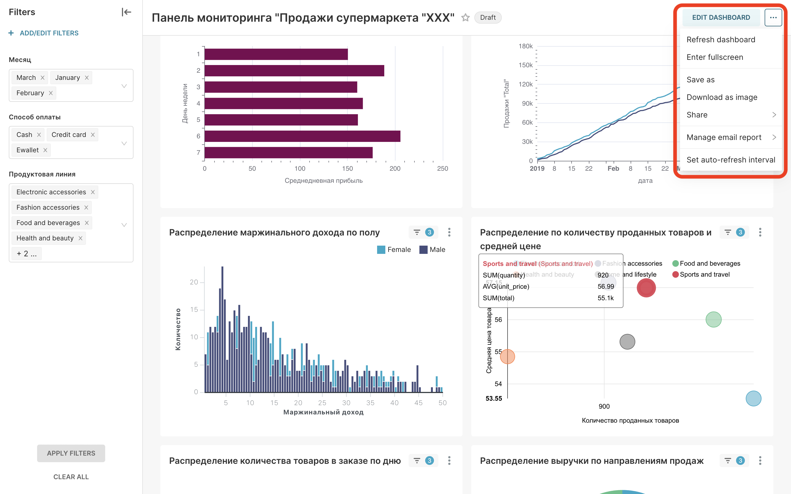

## Описание проекта
Целью настоящего проекта является демонстрация возможностей опенсорсного ПО в обработке данных.
Бизнес логика следующая:
* Заказчик кладет в s3-совместимый бакет csv файл с выгруженными данными о продажах супермаркета  
* Название файла меняться НЕ должно. Наличие суффикса в виде даты и тп обсуждается дополнительно
* Состав и название колонок меняться НЕ должны. Предполагается что выгрузка осуществляется из единой системы заказчика.
* Периодичность выгрузки и пересечение данных значения НЕ имеет

## Описание инфраструктуры
Предполагается что инфраструктура будет располагаться в облаке, но ввиду отсутствия доступа к облакам и в целях демонстрации 
развернем инфраструктуру в докер-контейнерах на локальном компьютере c mac osx m1  
____
Схема инфраструктуры   

#### Airflow
1. Скачиваем в директорию с проектом файл __docker-compose.yaml__ `curl -LfO 'https://airflow.apache.org/docs/apache-airflow/2.3.3/docker-compose.yaml'`
2. Создаем директории `mkdir -p ./dags ./logs ./plugins ./data`. Data понадобится когда будем скачивать сырые файлы
3. Для работы на локальном компе можно выставить `AIRFLOW__CORE__EXECUTOR: LocalExecutor` и удалить из __docker-compose.yaml__ все что связано с celery и redis, но профиту от этого мало
4. Инициализируем базу __AIRFLOW__ командой `docker compose up airflow-init`. Сборка завершена с кодом 0 - т.е. успешно
5. Запускаем остальные контейнеры с севисами __AIRFLOW__ `docker-compose up -d`
6. Если надо добавить библиотеки создаем __requirements.txt__, пересобираем образ командой `docker build . --tag extending_airflow:latest`. При этом прописываем название после тега в копии __docker-compose.yaml__
7. Переназываем новый __docker-compose-ext.yaml__
8. Закрываем все контейнеры командой `docker compose down`
9. Заново инициализируем базу __AIRFLOW__ командой `docker compose up airflow-init` на основе первого __docker-compose.yaml__ 
10. Запускаем остальные контейнеры на основе расширенного __docker-compose-ext.yaml__ `docker-compose -f docker-compose-ext.yaml up -d --no-deps --build airflow-webserver airflow-scheduler airflow-worker airflow-triggerer`

#### DWH
11. Поднимаем контейнер с __DWH на posrgres__. Переходим в папку `postgres_docker` и находясь там запускаем `docker-compose up -d`

#### Minio (S3)
12. Поднимаем контейнер с __minio бакет сомвестисый с s3__. Переходим в папку `minio_docker` и находясь там запускаем `docker-compose up -d`

#### BI
13. Поднимаем контейнер с __SUPERSET__. Переходим в папку `superset_docker` и находясь там запускаем `docker-compose -f docker-compose-non-dev.yml`
____
Проверяем работоспособность всех контейнеров 
____
Пробуем загрузить файл в бакете 

## Описание схемы хранилища
1. Хранилище будет располагаться на базе __postgres__
2. Хранилище будет состоять из двух слоев __stage__ и нормализованного до 3NF __nds__
3. Формирование витрин будет осуществляться в BI системе на базе __apache_superset__ по запросу заказчика. В качестве демонстрации будет создана денормализованная таблица с расширенными признаками времени и даты
4. Хранилище будет сформировано по схеме __звезда__, где таблица фактов ссылается по внешним ключам на таблицы измерений  
____
Схема слоя stage   
____
Схема слоя nds 

## Описание ETL процесса
1. Заказчик кладет выгрузку в формате csv в бакет совместимый с S3
2. Даг airflow активируется при срабатывании сенсора, когда в определенный бакет попадает определенный файл
3. Следующий таск сохраняет файл в файловой системе airflow (предполагается что заказчик присылает выгрузку не за 10 лет. несколько сотен тысяч строк допустимо)
4. При сохранении файла airflow дает ему техническое название и сохраняет без расширения. Перенаименовываем сохраненный файл
5. Параллельно проверяем есть ли нужные сущности в слое nds. Если нет - создаем их. По идее создание таблиц осуществится в первый раз. В последующие разы тас будет проходить мимо
6. Сразу же заливаем измерения Время и Дата, так как они не зависят от получаемых данных
7. Из полученного файла получаем уникальные названия измерений:  
   * Направление продаж
   * Гендер
   * Товарная группа
   * Способ оплаты
   * Город
   * Тип покупателя
   Заливаем эти данные в слой stage. Не заботимся ни о ключах ни о формате
8. После сохранения файла в файловой системе удаляем его из s3
9. После сохранения таблиц с измерениями в stage сравниваем названия с уже существующими уникальными значениями в аналогичных таблицах в слое nds
10. Т.к. таблицы в слое nds обладают инкрементальными ключами добавление новых значений будет увеличивать номера ключей. Прежние ключи останутся без изменений
11. В следующем таске получаем обновленные таблицы с измерениями и ключами и преобразуем их в питоновские словари меняя местами ключ-значение
12. Снова возвращаемся к скаченному файлу и меняем все измерения с текста на номера ключей. Преобразуем форматы дат и времени
13. Заливаем полученную таблицу в слой nds
14. Сравниваем номера заказов с номерами ранее загруженных строк с заказами в слое nds и добавляем новые уникальные строки с заказами
15. Таким образом мы будем получать новые данные не затирая предыдущие и исключаем возможное дублирование  
16. После сохранения свежих фактов в слое nds удаляем файл csv из файловой системы airflow
________
Схема ETL процесса (DAG)   

## BI superset
Поскольку на территории РФ использование Tableau невозможно, а MS Power BI выпускается только для OS Windows будем использовать superset
1. Подключаемся по дефорлтным логину и паролю 
2. Создаем подключение к хранилищу на postgres 
3. Создаем датасет из sql запроса. В нашем случае это денормализованная таблица с расширенными измерениями даты и времени 
 [Денормализованная таблица](sqllab_dns_sales_20230430T130150.csv)
4. Создаем чарты и собираем их в дашборд 
5. В UI superset без труда можно настроить автоматическое обновление и рассылку 